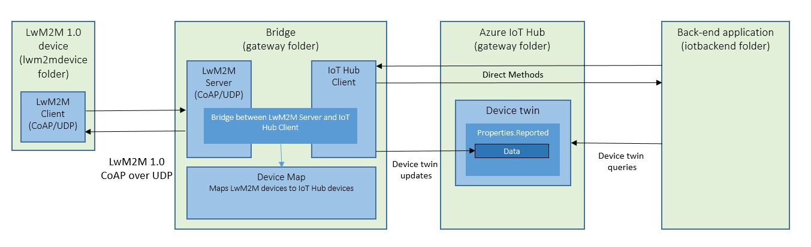
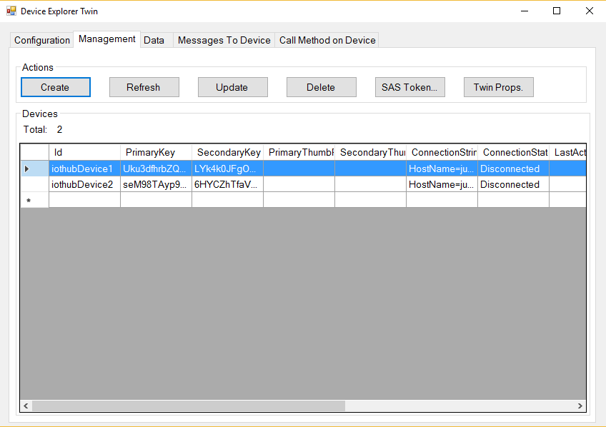
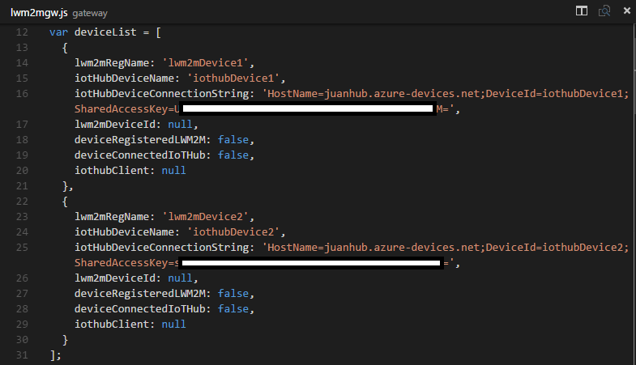
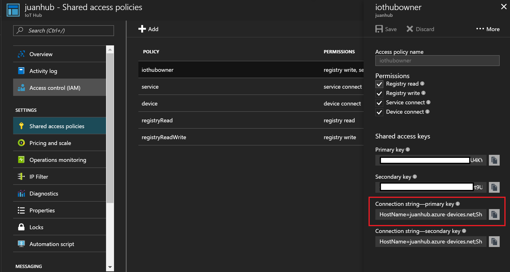

This project has adopted the [Microsoft Open Source Code of Conduct](https://opensource.microsoft.com/codeofconduct/). For more information see the [Code of Conduct FAQ](https://opensource.microsoft.com/codeofconduct/faq/) or contact [opencode@microsoft.com](mailto:opencode@microsoft.com) with any additional questions or comments.

# LwM2M 1.0 to Azure IoT Hub Bridge Sample

## Overview 

The LwM2M to Azure IoT Hub bridge sample provides a model for how to enable LwM2M 1.0 devices to leverage capabilities of IoT Hub without any modifications.

Conceptually, the bridge hosts a LwM2M server and bridges interactions with a LwM2M device to a cloud back-end application through Azure IoT Hub.  This enables cloud back-end applications (e.g. IoT operator portals) to have a single pane-of-glass for all devices managed through IoT Hub, including devices that have LwM2M clients and are managed by a LwM2M server.

This sample also showcases how products that host LwM2M servers can interface with Azure IoT Hub to very quickly benefit from the benefits of cloud (e.g. scale, high availability, region availability, and Azure's data pipline for warm and cold path analytics and machine learning, among others).



### LwM2M Device

The LwM2M device in this sample uses the [LwM2M Node Lib](https://github.com/telefonicaid/lwm2m-node-lib) Node.js library to register as a device with the LwM2M server that is hosted inside the bridge.

This device can be replaced with a physical or simualted device that uses LwM2M, including devices that use [Eclipse Wakaama](https://github.com/eclipse/wakaama) or [Eclipse Leshan](https://github.com/eclipse/leshan).

### Bridge

The bridge component provides the following blocks that interact to enable communications from LwM2M devices to IoT Hub.

- LwM2M Server: A LwM2M server using [LwM2M Node Lib](https://github.com/telefonicaid/lwm2m-node-lib) is hosted and available for LwM2M devices to register and unregister.  When a LwM2M device registers, the bridge will use the IoT Hub client to connect a IoT Hub client to IoT Hub.  This enables the cloud back-end application to call direct methods on the bridge that will get translated to LwM2M/CoAP requests on the device.

- IoT Hub Client: The IoT Hub client, once connected to IoT Hub on behalf of a registering LwM2M device, becomes availabe for the cloud back-end application to make LwM2M/CoAP requests on the device.

- Device Map: A JSON object in lwm2mgw.js maps a LwM2M device ID to a IoT Hub device connection string.  When a LwM2M device registers with the LwM2M server, the register handler uses the device map to find the corresponding IoT Hub device connection string.  

### Back-end application

The back-end application uses the IoT Hub service client and uses direct methods to trigger LwM2M operations on the bridge.

## Setup and config

1. Create identity for devices in IoT Hub using device explorer.  You can use iothubDevice1 and iothubDevice2 to show the difference between LwM2M devices and IoT Hub devices.

  

2. Open lwm2mgw.js and edit the deviceList array to include the IoT Hub device connection string for each device for which you created an IoT Hub identity in the previous step.

  
  
3. Open iotbackend/backend.js and enter your IoT Hub connection string into the 'connectionString' variable, which can be found in the Azure portal:

  

4. Install NPM dependencies:

  ```npm install lwm2m-node-lib```
  
  ```npm install async```
  
  ```npm install azure-iot-device-mqtt```
  
  ```npm install azure-iot-device```
  
## Running through the scenario

1. Start the bridge, which will start the LwM2M server and listen for LwM2M devices to register.

  ``` node gateway/lwm2mgw.js ```

2. Start the LwM2M device in a new terminal window, which will register with the LwM2M server hosted in the bridge and connect an IoT Hub client to the mapped IoT Hub device ID.

  ``` node lwm2mdevice/device.js lwm2mDevice1 ``` 
  
3. Start the back-end application in a new terminal window, which will initiate LwM2M gestures (e.g. Get, Execute, Write, Observe) on the devices by using direct methods.

  ``` node iotbackend/backend.js iothubDevice1 ``` 

## Current gaps that need work

The following are areas for improvement for this sample:

- Support DTLS.  LwM2M-Node-Lib does not have support for DTLS.
- Support observe on the device and the bridge.  When a device does a Notify (from an observed resource) the bridge should both update the device twin reported properties and send a telemetry message with the update.
- Show how the back-end application can use device twin queries to find devices based on LwM2M resources and resource values.  E.g. Find all LwM2M devices that have firmwareVersion = 1.2.
- Support LwM2M Update Registration gestures from a device.
- Show how a back-end application can use IoT Hub jobs to scale out LwM2M execute actions on LwM2M devices (e.g. reboot, firmware update, etc...).
- Support Azure Key Vault to manage keys in the device map.


